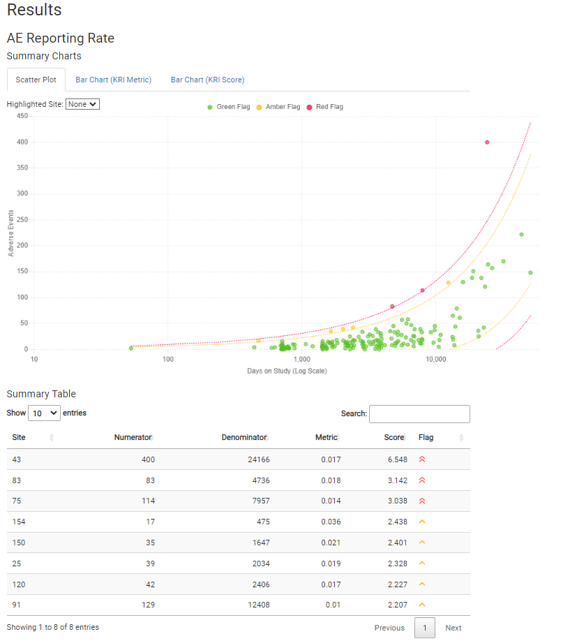

<!-- badges: start -->

 

<!-- badges: end -->

# Good Statistical Monitoring {gsm} R package

The {gsm} package provides a standardized Risk Based Quality Monitoring (RBQM) framework for clinical trials that pairs a flexible data pipeline with robust reports like the one shown below.  

 
 

This README provides a high-level overview of {gsm}; see the [package website](https://gilead-biostats.github.io/gsm/) for additional details.

# Background 

The {gsm} package performs risk assessments primarily focused on detecting differences in quality at the site-level. "High quality" is defined as the absence of errors that matter. We interpret this as focusing on detecting potential issues related to critical data or process across the major risk categories of safety, efficacy, disposition, treatment, and general quality, where each category consists of one or more risk assessment(s). Each risk assessment will analyze the data to flag sites with potential issues and provide a visualization to help the user understand the issue. Some relevant references are provided below. 

- Centralized Statistical Monitoring: [1](https://documents.pub/reader/full/centralized-statistical-monitoring-to-detect-data-integrity-issues-statisticalcentralized), [2](https://www.ncbi.nlm.nih.gov/pmc/articles/PMC7308734/), [3](https://www.magiworld.org/Journal/2014/1411_Centralized.pdf)
- EMA/FDA Guidance on Risk Based Management: [1](https://www.fda.gov/media/121479/download), [2](https://www.fda.gov/media/116754/download), [3](https://www.fda.gov/media/129527/download), [4](https://www.ema.europa.eu/en/documents/scientific-guideline/reflection-paper-risk-based-quality-management-clinical-trials_en.pdf)
- Risk Based Quality Management: [1](https://www.acrohealth.org/wp-content/uploads/2019/10/CRO-Forum-RBQM-Oversight-Paper-FINAL-Oct-2019.pdf), [2](http://www.transceleratebiopharmainc.com/wp-content/uploads/2017/09/Risk-Based-Quality-Managment.pdf), [3](https://www.magiworld.org/Journal/2014/1411_Centralized.pdf)
- Related tools: [1](https://cluepoints.com/), [2](https://www.saama.com/case-study/rbm-success-story/)

# Process Overview

The {gsm} package establishes a data pipeline for RBM using R. The package provides a framework that allows users to **assess** and **visualize** site-level risk in clinical trial data. The package currently provides assessments for the following domains:

1.  Adverse Event Frequency
2.  Serious Adverse Event Frequency
3.  Protocol Deviation Frequency
4.  Important Protocol Deviation Frequency
5.  Lab Abnormality Frequency
6.  Subject Discontinuation Frequency
7.  Treatment Discontinuation
8.  Query Rate
9.  Query Age
10. Data Entry Lag
11. Data Change Rate
12. Screen Failure

All {gsm} assessments use a standardized 6 step data pipeline: 

1.  **Map** (*Optional*) - Converts `raw` data to `input` data.
2.  **Transform** - Converts `input` data to `transformed` data.
3.  **Analyze** - Converts `transformed` data to `analyzed` data.
4.  **Threshold** - Uses `analyzed` data to create one or more numeric `thresholds`.
5.  **Flag** - Uses `analyzed` data and numeric `thresholds` to create `flagged` data.
6.  **Summarize** - Selects key columns from `flagged` data to create `summary` data.

To learn more about {gsm}'s data pipeline, visit the [Data Pipeline Vignette](https://gilead-biostats.github.io/gsm/articles/DataPipeline.html).

# Reporting

Detailed RMarkdown/HTML reporting is built into `{gsm}`, and provides a detailed overview of all risk assessments for a given trial. For example, an AE risk assessment looks like this: 

 

Full reports for a sample trial run with [`{clindata}`](https://github.com/Gilead-BioStats/clindata) are provided below:

- [Site Report](https://gilead-biostats.github.io/gsm/StandardReportSite.html)
- [Country Report](https://gilead-biostats.github.io/gsm/StandardReportCountry.html)

# Quality Control

Since {gsm} is designed for use in a [GCP](https://en.wikipedia.org/wiki/Good_clinical_practice) framework, we have conducted extensive quality control as part of our development process. In particular, we do the following:  

- **Qualification Workflow** - All assessments have been Qualified as described in the Qualification Workflow Vignette. A Qualification Report Vignette is generated and attached to each release. 
- **Unit Tests** - Unit tests are written for all core functions.
- **Contributor Guidelines** - Detailed contributor guidelines including step-by-step processes for code development and releases are provided as a vignette.
- **Data Model** - Vignettes providing detailed descriptions of the data model.
- **Code Examples** - The Cookbook Vignette provides a series of simple examples, and all functions include examples as part of Roxygen documentation. 
- **Code Review** - Code review is conducted using GitHub Pull Requests (PRs), and a log of all PRs is included in the Qualification Report Vignette.
- **Function Documentation** - Detailed documentation for each function is maintained with Roxygen.
- **Package Checks** - Standard package checks are run using GitHub Actions and must be passing before PRs are merged.
- **Data Specifications** - Machine-readable data specifications are maintained for all KRIs. Specifications are automatically added to relevant function documentation.
- **Continuous Integration** - Continuous integration is provided via GitHub Actions. 
- **Regression Testing** - Extensive QC and testing is done before each release. 
- **Code Formatting** - Code is formatted with {styler} before each release. 
 
Additional detail, including links to functional documentation and vignettes, is available in the [package website](https://gilead-biostats.github.io/gsm/).
