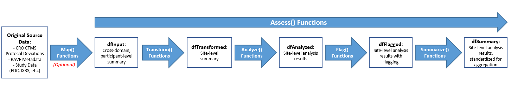
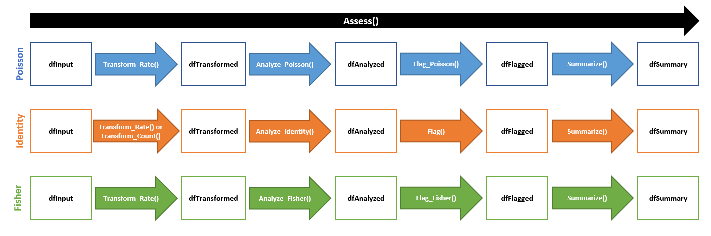

```{r setup, include = FALSE}
knitr::opts_chunk$set(
  collapse = TRUE,
  comment = "#>"
)

library(gsm)
library(tidyverse)
library(DT)
library(rmdformats)
library(gt)

dt <- function(data){
  data %>%
    DT::datatable(
      extensions = 'FixedColumns',
      options = list(
        scrollX = TRUE,
        fixedColumns = TRUE
      ),
      rownames = FALSE
    )
}
```

# Introduction

This vignette walks users through the mechanics of the `Assess()` functions within the `{gsm}` package. `{gsm}` leverages Key Risk Indicators (KRIs) and thresholds to conduct study-level and site-level Risk Based Monitoring for clinical trials. The `Assess()` functions provide data frames, visualization, and metadata to be used in reporting and error checking at clinical sites. The image below illustrates the supporting functions that feed into the workflow of the `Assess()` functions.

{width=100%}

All of these functions will run automatically and sequentially when a user calls upon a given `Assess()` function.

Each of these individual functions can also be run independently outside of an `Assess()` function.

For the purposes of this documentation, we will evaluate the input(s) and output(s) of each individual function to show the stepwise progression of how `Assess()` handles and processes data.

------------------------------------------------------------------------

## A Technical Demo - Step-By-Step

We will use sample clinical data from the `{clindata}` package to run the Adverse Events (AE) Assessment, i.e., `AE_Assess()`.

### 1. Create `dfInput`

Generating input data is outside the scope of the assessment pipeline itself. However, the specifications for `dfInput` are designed to be flexible enough so that this data frame can be generated from multiple clinical data standards. For example, users can run the `Map_Raw()` or `Map_Adam()` functions, which will create `dfInput` from Raw+ data or CDISC-compliant ADaM data, respectively. 

The data frame `dfInput` for an Adverse Event will be created by running `AE_Map_Raw()` and will have one record per subject, with the following columns:

-   `SubjectID` = Subject Identifier
-   `SiteID` = Site Identifier
-   `StudyID` = Study Identifier
-   `CustomGroupID` = Custom Group Identifier (in this example, set to Country ID)
-   `Exposure` = Total Time on Treatment (measured in days; per subject)
-   `Count` = Total Number of Event(s) of Interest (in this example, the number of AEs reported; per subject)
-   `Rate` = Rate of Event Incidence (calculated as `Exposure`/`Count`; per subject)

```{r}
dfInput <- AE_Map_Raw(
  dfs = list(
    dfSUBJ = clindata::rawplus_dm,
    dfAE = clindata::rawplus_ae
  )
)
```

```{r echo = FALSE}
dt(dfInput)
```

------------------------------------------------------------------------

### 2. Create `dfTransformed`

The data frame `dfTransformed` is derived from `dfInput` using one of the following functions (depending on the assessment being run):

-   `Transform_Rate()`: Calculates cumulative rate of Event(s) of Interest per site. In our example, the default metric for AEs is the number of AEs reported over the course of treatment per site.
-   `Transform_Count()`: Calculates cumulative numer of Event(s) of Interest per site. *This function is not used in `AE_Assess()` because the default metric for AEs is a rate.*

The resulting `dfTransformed` data frame will contain site-level transformed data, including KRI calculation. Using our example AE data, `dfTransformed` contains the following columns:

-   `GroupID` = Group Identifier (default is Site ID)
-   `Numerator` = Cumulative Number of Event(s) of Interest (in this example, number of AEs reported across subjects)
-   `Denominator` = Cumulative Time on Treatment (in days, across subjects)
-   `Metric` = Rate of Event(s) of Interest (in this example, number of AEs reported over the course of treatment in days)

```{r}
dfTransformed <- Transform_Rate(
  dfInput,
  strNumeratorCol = "Count",
  strDenominatorCol = "Exposure"
)
```

```{r, echo = FALSE}
dt(dfTransformed)
```

------------------------------------------------------------------------

### 3. Create `dfAnalyzed`

The data frame `dfAnalyzed` is derived from `dfTransformed` using one of the following functions, which were built from a specific statistical model (depending on the assessment being run):

-   `Analyze_Fisher()`: Uses Fisher's Exact Test to determine if there are non-random associations between a site and a given KRI
-   `Analyze_Identity()`: Used in the data pipeline between `Transform()` and `Flag()` functions to rename KRI and Score columns
-   `Analyze_Poisson()`: Uses a Poisson model to describe the distribution of events in the overall site population, i.e., determine how many times an event is likely to occur at a site over a specified treatment period

The resulting `dfAnalyzed` data frame will contain site-level analysis results data. The Poisson model is the default analysis function for AE data, so using our example AE data, `dfAnalyzed` contains the following columns:

-   `GroupID` = Group Identifier (default is Site ID)
-   `Numerator` = Cumulative Number of Event(s) of Interest (in this example, number of AEs reported across subjects); Carried from `dfTransformed`
-   `Denominator` = Cumulative Time on Treatment (in days, across subjects); Carried from `dfTransformed`
-   `Metric` = Rate of Event(s) of Interest (in this example, number of AEs reported over the course of treatment in days); Carried from `dfTransformed`
-   `Score` = Calculated Residual (per site)
-   `PredictedCount` = Calculated Predicted Count (per site)

```{r}
dfAnalyzed <- Analyze_Poisson(dfTransformed)
```

```{r, echo = FALSE}
dt(dfAnalyzed)
```

------------------------------------------------------------------------

### 4. Create `dfFlagged`

The data frame `dfFlagged` is derived from `dfAnalyzed` using one of the following functions (depending on the assessment and the specific statistical model that was run):

-   `Flag_Fisher()`: Default flagging function when `Analyze_Fisher()` is used for an assessment
-   `Flag_Poisson()`: Default flagging function when `Analyze_Poisson()` is used for an assessment
-   `Flag()`: Default flagging function when `Analyze_Identity()` is used for an assessment

The resulting `dfFlagged` data frame will contain site-level analysis results data with flagging incorporated based on a pre-specified statistical threshold to highlight possible outliers. The default threshold for the AE Poisson model is (-7, -5, 5, 7) based on the available literature, so using our example AE data, `dfFlagged` contains the following columns:

-   `GroupID` = Group Identifier (default is Site ID)
-   `Numerator` = Cumulative Number of Event(s) of Interest (in this example, number of AEs reported across subjects); Carried from `dfAnalyzed`
-   `Denominator` = Cumulative Time on Treatment (in days, across subjects); Carried from `dfAnalyzed`
-   `Metric` = Rate of Event(s) of Interest (in this example, number of AEs reported over the course of treatment in days); Carried from `dfAnalyzed`
-   `Score` = Calculated Residual (per site); Carried from `dfAnalyzed`
-   `PredictedCount` = Calculated Predicted Count (per site); Carried from `dfAnalyzed`
-   `Flag` = Flag Indicating Possible Statistical Outliers; Valid values for this variable include -2, -1, 0, 1, and 2, which determine the "extremeness" of the outlier. -2 and 2 represent more extreme outliers, -1 and 1 represent less extreme outliers, and 0 represents a non-outlier.

```{r}
dfFlagged <- Flag_Poisson(dfAnalyzed, vThreshold = c(-7, -5, 5, 7))
```

```{r, echo = FALSE}
dt(dfFlagged)
```

------------------------------------------------------------------------

### 5. Create `dfSummary`

The data frame `dfSummary` is derived from `dfFlagged` using the `Summarize()` function. The resulting `dfSummary` data frame will contain the most relevant columns from `dfFlagged` with data sorted in a meaningful way to provide a concise overview of the assessment. Flagged sites will sort earlier than non-flagged sites, with the more "extreme" outliers displayed first. The columns in `dfSummary` include:

-   `GroupID` = Group Identifier (default is Site ID)
-   `Metric` = Rate of Event(s) of Interest (in this example, number of AEs reported over the course of treatment in days)
-   `Score` = Calculated Residual (per site)
-   `Flag` = Flag Indicating Possible Statistical Outliers; Valid values for this variable include -2, -1, 0, 1, and 2, which determine the "extremeness" of the outlier. -2 and 2 represent more extreme outliers, -1 and 1 represent less extreme outliers, and 0 represents a non-outlier.

```{r}
dfSummary <- Summarize(dfFlagged)
```

```{r, echo = FALSE}
dt(dfSummary)
```

------------------------------------------------------------------------

### 6. Data Visualization

Data visualizations are built into each `Assess()` function/KRI using the following functions:

-   `Visualize_Scatter`: Creates scatter plot of Total Exposure (in days, on log scale) vs Total Number of Event(s) of Interest (on linear scale). Each data point represents one site. Outliers are plotted in red with the site label attached. This plot is only created when statistical method is **not** defined as `identity`.
-   `Visualize_Score`: Provides a standard visualization for Score or KRI
-   `Visualize_Workflow`: Provides a flowchart with a high-level overview of the data pipeline for a given assessment

For an AE assessment, a scatter plot is created using `dfTransformed` to define bounds and `dfFlagged` to plot the data. Using our example AE data, we see the following scatter plot:

```{r}
dfBounds <- Analyze_Poisson_PredictBounds(dfTransformed, vThreshold = c(-8, 8))

chart <- Visualize_Scatter(dfFlagged, dfBounds)
```

```{r, echo = FALSE}
chart
```

------------------------------------------------------------------------

# Recap

-   `dfInput` used as original input; Can be created using `Map_Raw()` or `Map_Adam()`, if needed
-   `dfTransformed` created from `dfInput` using `Transform_Count()` or `Transform_Rate()`
-   `dfAnalyzed` created from `dfTransformed` using `Analyze_Poisson()`, `Analyze_Fisher()`, or `Analyze_Identity()`
-   `dfFlagged` created from `dfAnalyzed` using `Flag_Poisson()`, `Flag_Fisher()`, or `Flag()`
-   `dfSummary` created from `dfFlagged` using `Summarize()`
-   Visualizations created from `dfTransformed` and `dfFlagged`

What statistical models are available for each assessment?

-   Adverse Events (AE) and Protocol Deviations (PD): **Poisson or Identity**
-   Subject Consent (Consent) and Inclusion/Exclusion (IE) Criteria: **Identity**
-   Subject Disposition (Disp) and Laboratory (LB) Results: **Fisher or Identity**


