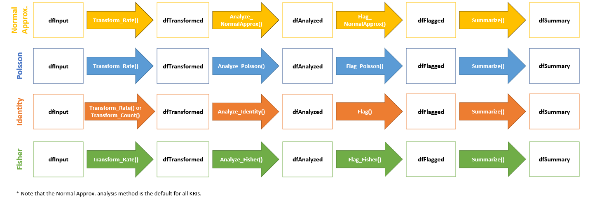

```{r setup, include = FALSE}
knitr::opts_chunk$set(
  collapse = TRUE,
  comment = "#>"
)

library(gsm)
library(gt)
library(DT)
```

# Introduction

This vignette walks users through the mechanics of the functions that produce all of the Analysis workflow output within the `{gsm}` package. `{gsm}` leverages Key Risk Indicators (KRIs) and thresholds to conduct study-level and site-level Risk Based Monitoring for clinical trials.

These functions provide data frames, visualizations, and metadata to be used in reporting and error checking at clinical sites. The image below illustrates the supporting functions that feed into the yaml workflow that is specified in each analysis workflow.

{width="100%"} 

All of these functions will run automatically and sequentially when a user calls upon the `RunWorkflow()` function with a specified yaml file for KRI metrics found in the `workflow/2_metrics` directory of the `{gsm}` package.

Each of these individual functions can also be run independently outside of a specified yaml workflow.

For the purposes of this documentation, we will evaluate the input(s) and output(s) of each individual function for a specific KRI to show the stepwise progression of how a  yaml workflow is set up to handle and process data.

------------------------------------------------------------------------

## Case Study - Step-by-Step Adverse Event KRI

We will use sample clinical data from the [`{clindata}`](https://github.com/Gilead-BioStats/clindata) package to run the Adverse Events (AE) Assessment, i.e., `AE_Assess()`, using the normal approximation method.

Additional statistical methods and supporting functions are explored in [Appendix 1](#appendix-1).

### 1. Create `dfInput`

Start by creating `dfInput` using sample rawplus data from `{clindata}`. Note that `Input_Rate()` requires three specific datasets from `{clindata}`, which include a subject-level demographics/exposure dataset (`dfSubjects`) and a domain-level dataset (`dfNumerator`) that records every adverse event per subject. 

Since `Input_Rate()` is a generalized function, it is also required that you specify the relevant column names for the Subject (`strSubjectCol`), Group (`strGroupCol`) and optionally the Denominator (`strDenominatorCol`) and Numerator (`strNumeratorCol`) when it is not simply "Denominator" or "Numerator", respectively.

Finally, the method for calculating the Numerator and Denominator is specified in `strNumeratorMethod` and `strDenominatorMethod` as either "Count" or "Sum".  If the method is "Count", the function simply counts the number of rows in the provided data frame. If the numerator method is "Sum", the function takes the sum of the values in the specified column (strNumeratorCol or strDenominatorCol). 


```{r include = TRUE}
dfInput <- Input_Rate(
              dfSubjects = clindata::rawplus_dm,
              dfNumerator = clindata::rawplus_ae,
              dfDenominator = clindata::rawplus_dm,
              strSubjectCol = "subjid",
              strGroupCol = "siteid",
              strNumeratorMethod = "Count",
              strDenominatorMethod = "Sum",
              strDenominatorCol = "timeonstudy"
)
```

The data frame `dfInput` for an AE assessment will be created by running `Input_Rate()` and will have one record per subject, with the following columns:

-   `SubjectID`: Subject Identifier
-   `GroupID`: Group Identifier
-   `GroupLevel`: Type of Group specified in `GroupID` (Country, Site)
-   `Numerator`: Total Time on Treatment (measured in days; per subject)
-   `Denominator`: Total Number of Event(s) of Interest (in this example, the number of AEs reported; per subject)
-   `Metric`: Rate of Event Incidence (calculated as `Exposure`/`Count`; per subject)

```{r echo = FALSE}
datatable(dfInput) %>%
  formatRound(columns = "Metric", digits = 3)
```

------------------------------------------------------------------------

### 2. Create `dfTransformed`

The data frame `dfTransformed` is derived from `dfInput` using a `Transform()` function. In our example, the analysis pipeline pulls in `Transform_Rate()` since the default metric for AEs is the number of AEs reported over the course of treatment per site, i.e., a rate.

```{r include = TRUE}
dfTransformed <- Transform_Rate(dfInput)
```

The resulting `dfTransformed` data frame will contain site-level transformed data, including KRI calculation. Using our example AE data, `dfTransformed` contains the following columns:

-   `GroupID`: Group Identifier (default is Site ID)
-   `GroupLevel`: Type of Group specified in `GroupID` (Country, Site)
-   `Numerator`: Cumulative Number of Event(s) of Interest (in this example, number of AEs reported across subjects)
-   `Denominator`: Cumulative Time on Treatment (in days, across subjects)
-   `Metric`: Rate of Event(s) of Interest (in this example, number of AEs reported over the course of treatment in days)

```{r, echo = FALSE}
datatable(dfTransformed) %>%
formatRound(columns = "Metric", digits = 3)
```

------------------------------------------------------------------------

### 3. Create `dfAnalyzed`

The data frame `dfAnalyzed` is derived from `dfTransformed` using an `Analyze()` function, which incorporates a specific statistical model. The resulting `dfAnalyzed` data frame will contain site-level analysis results data. The normal approximation method is the default statistical model for AE data, so the analysis pipeline automatically runs `Analyze_NormalApprox()`.

```{r include = TRUE}
dfAnalyzed <- Analyze_NormalApprox(dfTransformed)
```

Using our example AE data, `dfAnalyzed` contains the following columns:

-   `GroupID`: Group Identifier (default is Site ID)
-   `GroupLevel`: Type of Group specified in `GroupID` (Country, Site)
-   `Numerator`: Cumulative Number of Event(s) of Interest (in this example, number of AEs reported across subjects); Carried from `dfTransformed`.
-   `Denominator`: Cumulative Time on Treatment (in days, across subjects); Carried from `dfTransformed`.
-   `Metric`: Rate of Event(s) of Interest (in this example, number of AEs reported over the course of treatment in days); Carried from `dfTransformed`.
-   `OverallMetric`: Aggregate metric for the group that is being assessed. ( sum(Numerator) / sum(Denominator) ).
-   `Factor`: Calculated over-dispersion adjustment factor (mean of the z-score sum of squares calculated in the analysis functions).
-   `Score`: Calculated Residual (per site).

```{r, echo = FALSE}
datatable(dfAnalyzed) %>%
  formatRound(columns = c("Metric", "OverallMetric", "Factor", "Score"), digits = 3)
```

------------------------------------------------------------------------

### 4. Create `dfFlagged`

The data frame `dfFlagged` is derived from `dfAnalyzed` using a `Flag()` function. The resulting `dfFlagged` data frame will contain site-level analysis results data with flagging incorporated based on a pre-specified statistical threshold to highlight possible outliers.

```{r include = TRUE}
dfFlagged <- Flag_NormalApprox(dfAnalyzed, vThreshold = c(-3, -2, 2, 3))
```

The default flagging function for the normal approximation method is `Flag_NormalApprox()` and the default threshold is (-3, -2, 2, 3). Using our example AE data, `dfFlagged` contains the following columns:

-   `GroupID`: Group Identifier (default is Site ID)
-   `GroupLevel`: Type of Group specified in `GroupID` (Country, Site)
-   `Numerator`: Cumulative Number of Event(s) of Interest (in this example, number of AEs reported across subjects); Carried from `dfAnalyzed`
-   `Denominator`: Cumulative Time on Treatment (in days, across subjects); Carried from `dfAnalyzed`
-   `Metric`: Rate of Event(s) of Interest (in this example, number of AEs reported over the course of treatment in days); Carried from `dfAnalyzed`
-   `OverallMetric`: Aggregate metric for the group that is being assessed. ( sum(Numerator) / sum(Denominator) ).
-   `Factor`: Calculated over-dispersion adjustment factor (mean of the z-score sum of squares calculated in the analysis functions); Carried from `dfAnalyzed`.
-   `Score`: Calculated Residual (per site); Carried from `dfAnalyzed`
-   `Flag`: Flag Indicating Possible Statistical Outliers; Valid values for this variable include -2, -1, 0, 1, and 2, which determine the "extremeness" of the outlier. -2 and 2 represent more extreme outliers, -1 and 1 represent less extreme outliers, and 0 represents a non-outlier.

```{r, echo = FALSE}
datatable(dfFlagged)
```

------------------------------------------------------------------------

### 5. Create `dfSummary`

The data frame `dfSummary` is derived from `dfFlagged` using the `Summarize()` function. The resulting `dfSummary` data frame will contain the most relevant columns from `dfFlagged` with data sorted in a meaningful way to provide a concise overview of the assessment. Flagged sites will sort earlier than non-flagged sites, with the more "extreme" outliers displayed first. The columns in `dfSummary` include:

-   `GroupID`: Group Identifier (default is Site ID)
-   `GroupLevel`: Type of Group specified in `GroupID` (Country, Site)
-   `Numerator`: Cumulative Number of Event(s) of Interest (in this example, number of AEs reported across subjects); Carried from `dfAnalyzed`
-   `Denominator`: Cumulative Time on Treatment (in days, across subjects); Carried from `dfAnalyzed`
-   `Metric`: Rate of Event(s) of Interest (in this example, number of AEs reported over the course of treatment in days)
-   `Score`: Calculated Residual (per site)
-   `Flag`: Flag Indicating Possible Statistical Outliers; Valid values for this variable include -2, -1, 0, 1, and 2, which determine the "extremeness" of the outlier. -2 and 2 represent more extreme outliers, -1 and 1 represent less extreme outliers, and 0 represents a non-outlier.

```{r include = TRUE}
dfSummary <- Summarize(dfFlagged)
```

```{r, echo = FALSE}
datatable(dfSummary[-1,])
```


A full explanation of all Data Visualization options can be found in the `{gsm.kri}` package.

------------------------------------------------------------------------

# Recap - Normal Approximation Adverse Event KRI

-   `dfInput` used as original input using `Input_Rate()`
-   `dfTransformed` created from `dfInput` using `Transform_Rate()`
-   `dfAnalyzed` created from `dfTransformed` using `Analyze_NormalApprox()`
-   `dfFlagged` created from `dfAnalyzed` using `Flag_NormalApprox()`
-   `dfSummary` created from `dfFlagged` using `Summarize()`
------------------------------------------------------------------------

# Appendix 1 - Supporting Functions {#appendix-1}

The following sections include various examples of supporting functions and statistical models that can be employed in the Analysis workflow. Please note that this is **not** an exhaustive list, but includes some of the most commonly called upon functions.

### Mapping Functions

-   `RunQuery()`: Run a SQL query to create new data.frames with filtering and column name specifications.
-   `Input_Rate()`: Calculate a subject level rate from raw numerator and denominator data

### Transform Functions

-   `Transform_Rate()`: Calculates cumulative rate of Event(s) of Interest per site
-   `Transform_Count()`: Calculates cumulative number of Event(s) of Interest per site

### Analyze Functions

-   `Analyze_NormalApprox()`: Uses funnel plot method with normal approximation to create analysis results for percentage/rate.
-   `Analyze_Fisher()`: Uses Fisher's Exact Test to determine if there are non-random associations between a site and a given KRI
-   `Analyze_Identity()`: Used in the data pipeline between `Transform()` and `Flag()` functions to rename KRI and Score columns
-   `Analyze_Poisson()`: Uses a Poisson model to describe the distribution of events in the overall site population, i.e., determine how many times an event is likely to occur at a site over a specified treatment period

### Flag Functions

-   `Flag()`: Default flagging function that can be used for any method in an assessments
-   `Flag_NormalApprox()`(`deprecated`): Flagging function when `Analyze_NormalApprox()` is used for an assessment.
-   `Flag_Fisher()`(`deprecated`): Flagging function when `Analyze_Fisher()` is used for an assessment
-   `Flag_Poisson()`(`deprecated`): Flagging function when `Analyze_Poisson()` is used for an assessment

### What Statistical Models Are Available For Each Assessment?

-   By default, all yaml workflow assessments specified in the `inst/workflows/` directory use the [normal approximation](https://gilead-biostats.github.io/gsm/articles/KRI%20Method.html#the-normal-approximation-method) method.
-   Optionally, other statistical methods include: [**Poisson**](https://gilead-biostats.github.io/gsm/articles/KRI%20Method.html#the-poisson-regression-method), [**Fisher's Exact**](https://gilead-biostats.github.io/gsm/articles/KRI%20Method.html#the-fishers-exact-method), and [**Identity**](https://gilead-biostats.github.io/gsm/articles/KRI%20Method.html#the-identity-method).

{width="100%"}
