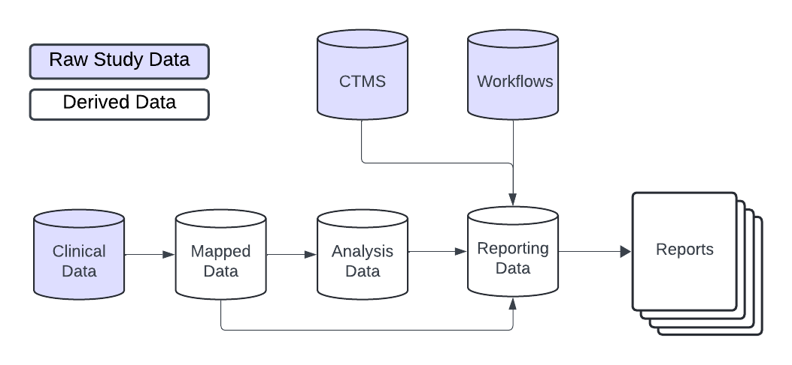

```{r setup, include = FALSE}
library(gsm)
library(gt)
library(dplyr)

knitr::opts_chunk$set(
  collapse = TRUE,
  comment = "#>"
)
```

# Introduction

The `{gsm}` suite of packages provides a standardized data pipeline for conducting study-level Risk Based Quality Management (RBQM) for clinical trials. There are four main types of data used in the `{gsm}` suite of packages:  

- **Raw Data** - Clinical and operational data from study databases
- **Mapped Data** - Data that has been transformed and standardized for analysis
- **Analysis Data** - Data that has been analyzed to calculate Key Risk Indicators (KRIs)
- **Reporting Data** - Data that has been summarized and formatted for reporting

This vignette provides a high-level overview of how each type of data is used, and includes detailed data specifications as appendices. 

# Data Model Overview 

In general, the `{gsm}` suite of packages is designed to be flexible and customizable, allowing users build custom data pipelines that support many types of raw study data. As shown below, raw clinical data is transformed into mapped data, which is then analyzed to calculate desired metrics. The analysis data is then combined and formatted for reporting with additional raw data, including CTMS data and `{gsm.mapping}` workflow data, which provides relevant metadata for reports.

{width="100%"}

# Raw and Mapped Data

The `{gsm}` suite of packages is designed to work with a wide variety of clinical data sources. The raw data used in the analysis pipeline is typically sourced from clinical trial databases and is transformed into mapped data using simple transformations. Mapped data is then used as input for the analysis pipeline. 

There is not a single data standard for raw or mapped data in `{gsm.mapping}`. The only requirement is that the mapped data is compatible with the analytics pipeline. Data Mapping transformations can be done using multiple methods including custom R scripts (e.g., with `dplyr`), SQL queries, or using `gsm.mapping` workflows (e.g. the `system.file("workflow/1_mapping/AE.yaml", package = "gsm.mapping")` file). Examples of these methods can be found in `vignette("Cookbook")`.

# Analysis Data 

In `{gsm.kri}` analysis data is used to capture key metrics associated with the conduct of a clinical trial. As described in the `{gsm.kri}` readme, 12 standard Key Risk Indicator (KRI) metrics are included in the package along with automated workflows that allow them to be run for all sites or countries in a study. Examples of KRIs include the rate of adverse events or amount of missing data at a site or across sites. Defining and deploying KRIs during continually monitor risks to the integrity of the trial and take corrective actions accordingly. 

{width="100%"}

The image above provides an overview of the default KRI analysis pipeline. The pipeline is a standardized five-step process for assessing data issues by going from participant-level input data to a standardized site-level summary of model results. The functions used in each step of the data pipeline along with the input and output datasets are described in more detail below.

1.  `dfInput`: Input data; Cross-domain participant-level input data with all needed data for KRI derivation. Created by the `Input_Rate()` function used `mapped` data as input.
2.  `dfTransformed`: Transformed data; Site-level transformed data including KRI calculation. Created by `Transform_*()` functions using `dfInput` as input.
3.  `dfAnalyzed`: Analyzed data; Site-level analysis results data. Created by `Analyze_*()` functions using `dfTransformed` as input.
4.  `dfFlagged`: Flagged data; Site-level analysis results with flags added to indicate potential statistical outliers. Created by passing numeric thresholds to a `Flag_*()` function using `dfAnalyzed` as input.
5.  `dfSummary`: Summary data; Standardized subset of the flagged data. This summary data has the same structure for all assessments and always includes both KRI and Flag values so that a user can easily look at trends for any given site across multiple assessments. Created using the `Summarize()` function using `dfFlagged` as input.

The data requirements for each component of the analysis pipeline are rigid; See [Appendix 1](#Appendix-1-Data-Model) for full specifications.

## Analysis Workflows
Since there are rigid data requirements for each component of the analysis data model, the analysis workflow is largely standardized. There are two main approaches to running the analysis workflow:

1. **Scripted Analysis**: Run each step of the analysis pipeline individually using the functions provided in the `{gsm}` suite of packages. This approach is useful for understanding the data requirements and for debugging. See Example 1 in `vignette("Cookbook")` for an example of this approach.
2. **Workflow Analysis**: Run the analysis pipeline using a YAML workflow file. This approach is useful for running the same analysis on multiple studies or for automating the analysis process. See Example 2 in `vignette("Cookbook")` for an example of this approach.

Note that each step in these workflows can be customized based on the requirements for a specific KRI. The graphic below shows four such workflows.

{width="100%"}

More details about analysis data pipelines can be found in `vignette("DataAnalysis")`.

# Reporting Data 

A rigid Reporting Data framework is provided in {gsm} to allow for standardized reporting, visualization and meta-analysis that compare risk profiles across timepoints, and even across multiple studies.  The Reporting Data sets used in {gsm} are: 

1. `Reporting_Results`: Summary data; Standardized subset of the flagged data. This summary data has the same structure for all assessments and always includes both KRI and Flag values so that a user can easily look at trends for any given site across multiple assessments. Created using the `Summarize()` function in the analytics pipeline, followed by the `BindResults()` function to add columns necessary for reporting and stack metrics and snapshots into a single data.frame.
3. `Reporting_Bounds`: Bounded data; A data.frame containing predicted boundary values with upper and lower bounds across the range of observed values. Created with the `MakeBounds()` function.
4. `Reporting_Groups`: Grouped data; Long data.frame of summarized group CTMS data with site, study, and country level counts and metrics. Constructed by binding data.frames created with `MakeLongMeta()`.
5. `Reporting_Metrics`: Metric metadata; Metric-specific metadata for use in charts and reporting. Created by passing an `lWorkflow` object to the `MakeMetric()` function.

Similar to Analysis Workflows, reporting data pipelines can be run as R scripts or as YAML workflows.  Example 3 in the cookbook vignette shows how to populate the Reporting Data tables using output from the Analysis Workflows and other study data sources. The Reporting Deep Dive Vignette provides more details on the Reporting Data model.

# Appendix 1 - Data Model

# Overview 
{width="100%"}

# Analytics data model

The KRI analytics pipeline is a standardized process for **Analyzing** data issues by going from participant-level `input` data to a standardized site-level `summary` of model results. The data sets used in each step of the data pipeline are described in detail below. When using a metric workflow YAML to create these tables, all data tables are contained in a list, which we call `lAnalysis`. This list is then fed into the reporting data pipeline.

## Analysis Data Tables
  
### `Analysis_Input`
  - Function(s) used to create table: 
    - `gsm.core::Input_Rate()`
  - Inputs: 
    - `Analysis_Subjects`
    - `Analysis_Numerator`
    - `Analysis_Denominator`
  - Usage: The base data.frame for all Analysis workflows. Feeds into the `Transform_*()` functions.
  - Structure:

  | Table    | Column Name  | Description                          | Type     | Optional  | 
  |----------|--------------|--------------------------------------|----------|--|
  | Analysis_Input  | SubjectID    | The subject ID                       | Character| |
  | Analysis_Input  | GroupID      | The group ID for the metric          | Character| | |
  | Analysis_Input  | GroupLevel   | The group type for the metric (e.g. "Site")    | Character| | 
  | Analysis_Input  | Numerator    | The calculated numerator value       | Numeric  | |
  | Analysis_Input  | Denominator  | The calculated denominator value     | Numeric | |
  | Analysis_Input  | Metric       | The calculated rate/metric value     | Numeric  | |


### `Analysis_Transformed`
  - Function(s) used to create table:
    - `gsm.core::Transform_Rate()`
    - `gsm.core::Transform_Count()`
  - Inputs: `Analysis_Input`
  - Usage: Convert from input data format to needed format to derive KRI for an Assessment via the `Analyze_*()` functions.
  - Structure:

  | Table    | Column Name  | Description                          | Type     | Optional  | 
  |----------|--------------|--------------------------------------|----------|--|
  | Analysis_Transformed | GroupID      | The group ID for the metric          | Character| | |
  | Analysis_Transformed | GroupLevel   | The group type for the metric (e.g. "Site")    | Character| | 
  | Analysis_Transformed | Numerator    | The calculated numerator value       | Numeric  | |
  | Analysis_Transformed | Denominator  | The calculated denominator value     | Numeric | |
  | Analysis_Transformed | Metric       | The calculated rate/metric value     | Numeric  | |

###  `Analysis_Analyzed`
  - Function(s) used to create table:
    - `gsm.core::Analyze_Fisher()`
    - `gsm.core::Analyze_Identity()`
    - `gsm.core::Analyze_NormalApprox()`
    - `gsm.core::Analyze_Poisson()`
  - Inputs: `Analysis_Transformed`
  - Usage: Prepare the data for `Flag_*()` by performing the specified test on the metric provided.
  - Structure:

  | Table    | Column Name  | Description                          | Type     | Optional  | 
  |----------|--------------|--------------------------------------|----------|--|
  | Analysis_Analyzed | GroupID      | The group ID for the metric          | Character| | |
  | Analysis_Analyzed | GroupLevel   | The group type for the metric (e.g. "Site")    | Character| | 
  | Analysis_Analyzed | Numerator    | The calculated numerator value       | Numeric  | |
  | Analysis_Analyzed | Denominator  | The calculated denominator value     | Numeric | |
  | Analysis_Analyzed | Metric       | The calculated rate/metric value     | Numeric  | |
  | Analysis_Analyzed | Score        | The Statistical Score      | Numeric  | |
  | Analysis_Analyzed | Overall Metric |       | Numeric  |* |
  | Analysis_Analyzed | Factor |      | Numeric  |* |
  | Analysis_Analyzed | Predicted Count |      | Numeric  |* |


### `Analysis_Flagged`
  - Function(s) used to create table:
    - `gsm.core::Flag()`
  - Inputs: `Analysis_Analyzed`
  - Usage: Flag a group-level metric to be summarized via `gsm.core::Summarize()` and used for reporting.
  - Structure:

  | Table    | Column Name  | Description                          | Type     | Optional  | 
  |----------|--------------|--------------------------------------|----------|--|
  | Analysis_Flagged | GroupID      | The group ID for the metric          | Character| | |
  | Analysis_Flagged | GroupLevel   | The group type for the metric (e.g. "Site")    | Character| | 
  | Analysis_Flagged | Numerator    | The calculated numerator value       | Numeric  | |
  | Analysis_Flagged | Denominator  | The calculated denominator value     | Numeric | |
  | Analysis_Flagged | Metric       | The calculated rate/metric value     | Numeric  | |
  | Analysis_Flagged | Score        | The Statistical Score     | Numeric  | |  
  | Analysis_Flagged | Flag        | The ordinal Flag to be applied     | Numeric  | |  
  | Analysis_Flagged | Overall Metric |       | Numeric  |* |
  | Analysis_Flagged | Factor |      | Numeric  |* |
  | Analysis_Flagged | Predicted Count |      | Numeric  |* |

###  `Analysis_Summary`
  - Function(s) used to create table:
    - `gsm.core::Summarize()`
  - Inputs: `Analysis_Flagged`
  - Usage: Summarize KRI at the group level for reporting.
  - Structure:

  | Table    | Column Name  | Description                          | Type     | Optional  | 
  |----------|--------------|--------------------------------------|----------|--|
  | Analysis_Summary      | GroupID      | The group ID for the metric          | Character| | |
  | Analysis_Summary      | GroupLevel   | The group type for the metric (e.g. "Site")    | Character| | 
  | Analysis_Summary      | Numerator    | The calculated numerator value       | Numeric  | |
  | Analysis_Summary      | Denominator  | The calculated denominator value     | Numeric | |
  | Analysis_Summary      | Metric       | The calculated rate/metric value     | Numeric  | |
  

# Overview of Reporting data model
  
## Reporting Data Tables
  
###  `Reporting_Results`
  - Function(s) used to create table:
    - `gsm.reporting::BindResults()`
  - Inputs: `lAnalysis`, `strStudyID`, `dSnapshotDate`
  - Workflow used to create table: `3_reporting/Results.yaml` in `{gsm.reporting}`
  - Usage: Summarize KRI at the group level for reporting.
  - Structure:

  | Table    | Column Name  | Description                          | Type     | Optional  | 
  |----------|--------------|--------------------------------------|----------|--|-----------|
  | Reporting_Results      | GroupID      | The group ID for the metric          | Character| |
  | Reporting_Results      | GroupLevel   | The group type for the metric (e.g. "Site")    | Character| |
  | Reporting_Results      | Numerator    | The calculated numerator value       | Numeric  | |
  | Reporting_Results      | Denominator  | The calculated denominator value     | Numeric | |
  | Reporting_Results      | Metric       | The calculated rate/metric value     | Numeric  | |
  | Reporting_Results      | Score        | The calculated metric score          | Numeric  | | 
  | Reporting_Results      | Flag         | The calculated flag                  | Numeric  | |
  | Reporting_Results      | MetricID     | The Metric ID                        | Character| * |
  | Reporting_Results      | StudyID      | The Study ID                         | Character| * |
  | Reporting_Results      | SnapshotDate | The Date of the snapshot             | Date     | * |

### `Reporting_Bounds`
  - Function(s) used to create table:
    - `gsm.reporting::MakeBounds()`
    - `gsm.core::Analyze_NormalApprox_PredictBounds()` (called within `gsm.reporting::MakeBounds()`)
  - Inputs: `lAnalysis`, `strStudyID`, `dSnapshotDate`
  - Workflow used to create table: `3_reporting/Bounds.yaml` in `{gsm.reporting}`
  - Usage: Calculates predicted percentages/rates and upper- and lower-bounds across the full range of sample sizes/total exposure values for reporting.
  - Structure:

  | Table    | Column Name  | Description                          | Type     | Optional  |
  |----------|--------------|--------------------------------------|----------|--|----------|
  | Reporting_Bounds | Threshold    | The number of standard deviations that the upper and lower bounds are based on   | Numeric| |
  | Reporting_Bounds | Denominator  | The calculated denominator value     | Numeric | |
  | Reporting_Bounds | LogDenominator  | The calculated log denominator value     | Numeric | |
  | Reporting_Bounds | Numerator    | The calculated numerator value       | Numeric  | |
  | Reporting_Bounds | Metric       | The calculated rate/metric value     | Numeric  | |
  | Reporting_Bounds | MetricID     | The Metric ID                        | Character|  |
  | Reporting_Bounds | StudyID      | The Study ID                         | Character|  | 
  | Reporting_Bounds | SnapshotDate | The Date of the snapshot             | Date     |  |

###  `Reporting_Groups`
  - Function(s) used to create table:
    - `gsm.reporting::MakeLongMeta()`
    - `dplyr::bind_rows()`
  - Inputs: CTMS site, study and country data
  - Workflow used to create table: `3_reporting/Groups.yaml` in `{gsm.reporting}`
  - Usage: Group-level metadata dictionary.
  - Structure: Long data frame, with certain `Param` required for given `GroupLevel`


| Table       | Column                | Description                       |Type      | Optional  |  
|-------------|-----------------------|-----------------------------------|----------|-----------|
| Reporting_Groups | GroupID                  | Unique Group ID                   | Character| | 
| Reporting_Groups | GroupLevel               | Group Level (e.g. Site, Country)  | Character| |
| Reporting_Groups | Param                    | Parameter Name (e.g. "Status")  | Character| | 
| Reporting_Groups | Value                    | Parameter Value (e.g. "Active")        | Character| | 

Expected `Param` by `GroupLevel` for use in gsm reporting. User may add other Param values as needed. 

| GroupLevel   | Param                | Description                       |Value Type |
|--------------|----------------------|-----------------------------------|----------|
| Study        | Status               | Study Status                      | Character|
| Study        | ParticipantCount     | # of Enrolled Participants        | Numeric |
| Study        | SiteCount            | # of Activated Sites                 | Numeric|
| Site         | ParticipantCount       | # of Enrolled Participants        | Numeric | 
| Site         | Status                 | Site Status       | Character | 
| Site         | InvestigatorFirstName  | Investigator First name        | Character | 
| Site         | InvestigatorLastName   | Investigator Last name        | Character | 
| Site         | City                   | City       | Character| 
| Site         | State                  | State      | Character | 
| Site         | Country                | Country       | Character | 
| Country      | EnrolledParticipants   | # of Enrolled Participants        | Numeric | 


###  `Reporting_Metrics`
  - Function used to create table: `gsm.reporting::MakeMetric()`
  - Inputs: `lWorkflows` - metadata for the corresponding kri(s) made with `gsm.core::MakeWorkflowList()`
  - Workflow used to create table: `3_reporting/Metrics.yaml` in `{gsm.reporting}`
  - Usage: Metadata used for charts and tables
  - Structure:

  | Table    | Column Name  | Description                          | Type     | Optional  |
  |----------|--------------|--------------------------------------|----------|--| -------------- |
  | Reporting_Metrics| File         | The YAML file for workflow          | Character|           | 
  | Reporting_Metrics| MetricID     | ID for the Metric   | Character| |
  | Reporting_Metrics| Group        | The group type for the metric (e.g. "Site")      | Character| | 
  | Reporting_Metrics| Abbreviation | Abbreviation for the metric   | Character| | 
  | Reporting_Metrics| Metric       | Name of the metric    | Character| | 
  | Reporting_Metrics| Numerator    | Data source for the Numerator          | Character| |
  | Reporting_Metrics| Denominator  | Data source for the Denominator | Character| | 
  | Reporting_Metrics| Model        | Model used to calculate metric     | Character| | 
  | Reporting_Metrics| Score        | Type of Score reported      | Character| | 

## Appendix 2 - Analysis Workflow Specifications

Assessment workflow metadata objects are passed to the `lWorkflow` parameter in `RunWorkflow()` to define functions and parameters across multiple studies.

The `lWorkflow` object is a named list of metadata and steps defining how each assessment should be run. By default, `gsm.core::MakeWorkflowList()` imports YAML specifications from `workflow/2_metrics` in `{gsm.kri}`. Each item in `lWorkflow` expects the following parameters in the `steps` section:

-   `workflow`: Array defining one or more functions to be executed as part of the workflow for a given assessment
    -   `workflow[]$meta`: specifies all of the metadata information for the KRI.
    -   `workflow[]$steps`: specifies all of the steps in the workflow.
        -   `workflow[]$steps$name`: name of the `{gsm}` function.
        -   `workflow[]$steps$inputs`: specifies the required input data
        -   `workflow[]$steps$output`: specifies the output data from the workflow step, which can be used as an input in the next step in the workflow
        -   `workflow[]$steps$params`: specifies parameters to be passed to the function

For example, the default workflow for the AE assessment (`system.file("workflow/2_metrics/kri0001.yaml", package = "gsm.kri")`) is shown below:

```{yaml eval = FALSE}
meta:
  Type: Analysis
  ID: kri0001
  GroupLevel: Site
  Abbreviation: AE
  Metric: Adverse Event Rate
  Numerator: Adverse Events
  Denominator: Days on Study
  Model: Normal Approximation
  Score: Adjusted Z-Score
  AnalysisType: rate
  Threshold: -2,-1,2,3
  nMinDenominator: 30
spec:
  Mapped_AE:
    subjid:
      type: character
  Mapped_SUBJ:
    subjid:
      type: character
    invid:
      type: character
    timeonstudy:
      type: integer
steps:
  - output: vThreshold
    name: gsm::ParseThreshold
    params:
      strThreshold: Threshold
  - output: Analysis_Input
    name: gsm::Input_Rate
    params:
      dfSubjects: Mapped_SUBJ
      dfNumerator: Mapped_AE
      dfDenominator: Mapped_SUBJ
      strSubjectCol: subjid
      strGroupCol: invid
      strGroupLevel: GroupLevel
      strNumeratorMethod: Count
      strDenominatorMethod: Sum
      strDenominatorCol: timeonstudy
  - output: Analysis_Transformed
    name: gsm::Transform_Rate
    params:
      dfInput: Analysis_Input
  - output: Analysis_Analyzed
    name: Analyze_NormalApprox
    params:
      dfTransformed: Analysis_Transformed
      strType: AnalysisType
  - output: Analysis_Flagged
    name: gsm::Flag_NormalApprox
    params:
      dfAnalyzed: Analysis_Analyzed
      vThreshold: vThreshold
  - output: Analysis_Summary
    name: gsm::Summarize
    params:
      dfFlagged: Analysis_Flagged
      nMinDenominator: nMinDenominator
  - output: lAnalysis
    name: list
    params:
      ID: ID
      Analysis_Input: Analysis_Input
      Analysis_Transformed: Analysis_Transformed
      Analysis_Analyzed: Analysis_Analyzed
      Analysis_Flagged: Analysis_Flagged
      Analysis_Summary: Analysis_Summary


```
