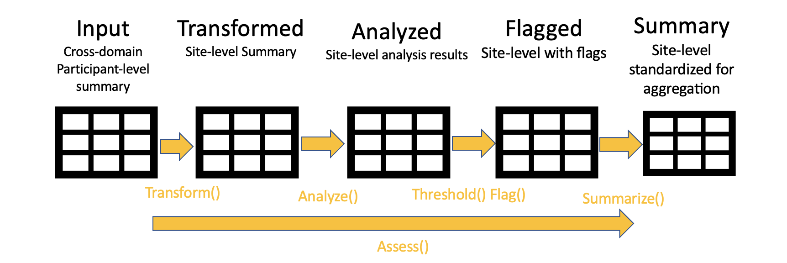

```{r setup, include = FALSE}
library(gsm)
knitr::opts_chunk$set(
  collapse = TRUE,
  comment = "#>"
)
```
# Intro

This vignette provides an overview of the gsm data pipeline and then provides data specifications for each assessment. First, we provide an overview of standardized the gsm Assessment data pipeline, and then we discuss the process for generating the needed input data for that pipeline. Finally, we provide data specifications for each assessment. 
 
# gsm Assessment Pipeline



The image above provides an overview of the {gsm} assessment pipeline. The pipeline is a standardized 4 step process for **assessing** data issues by going from participant-level `input` data to a standardized site-level `summary` of model results. The functions used in each step of the data pipeline along with the inputs and outputs data sets are described in more detail below.

## Assessment Pipeline Functions 

1. **Transform** - Converts `input` data to `transformed` data.
2. **Analyze** - Converts `transformed` data to `analyzed` data.
3. **Flag** - Uses `analyzed` data and numeric `thresholds` to create `flagged` data.
4. **Summarize** - Selects key columns from `flagged` data to create `summary` data.

## Assessment Pipeline Data Sets

1. `input` data - Cross-domain participant-level input data
2. `transformed` data - subject-level transformed data 
3. `analyzed` data - site-level analysis result data 
4. `flagged` data - site-level analysis results with flags added
5. `summary` data - standardized subset the flagged data. This summary data has the same structure for all assessments, so that we can easily look at trends for any given site across multiple assessments. 

Finally, each assessment has an `Assess` function that sequentially executes all 4 of the functions and returns a list containing all 5 data sets listed above. 

# Generating `input` data

Creating input data is outside the scope of the assessment pipeline. The specifications for `input` data are designed so that the data can easily be generated from multiple clinical data standards (e.g. Raw, ADaM or SDTM). Most assessments have `Map` functions that can be used to generate `input` data. For example, the Adverse event assessment has 2 map functions, `AE_Map_Raw()` and `AE_Map_Adam()` which create `input` data from Raw and ADaM data respectively. 

These `map` functions are provided for convenience, but may not work for all clinical studies. When no `map` function is available for a given assessment, it is expected that the user will manually create `input` data following the specifications for that assessment. 

# Assessment Specifications

The remainder of this vignette outlines data specifications for Raw* and Input data domains for each assessment in GSM. These specifications (and specifications for other supported inputs) for `Map` functions are also available in the function documentation for each assessment. Note also that all `map` functions make allowances for customization

(* - Note that the `gsm::x_Map_Raw()` functions generally expect data formatted as Raw+ or SDTM-, so some data manipulation will typically need to be done to raw CRF data before calling those functions.)

## Adverse Events (AE)

### Raw Data Spec

- dfAE (1 rec per AE)
  - SubjectID (str)
  - SiteID (str)
- dfDemog (1 rec per SubjectID)
  - SubjectID (unique, str)
  - SiteID (str)
  - TimeOnTreatment - Time on Treatment in Days (Integer)

Notes: 
- Errors for NA, NaN or empty values found in any required columns. 
- Error thrown for duplicate SubjectID in dfDemog. 
- The general expectation is that dfDemog will only contain randomized participants, but that is not a formal requirement. 
- The AE assessment can be run multiple times for different subsets of AE. Simply subset dfAE to the desired AE characteristic and re-run the mapping and the pipeline. 

### Input Data Spec

dfInput (one record per SubjectID)
  - SubjectID (unique, str)
  - SiteID (str)
  - Count (integer) - number of adverse events
  - Exposure (integer) - number of days on treatment

Notes: 
- Errors for NA, NaN or empty values found in any required columns. 
- Error thrown for duplicate SubjectID in dfDemog. 
