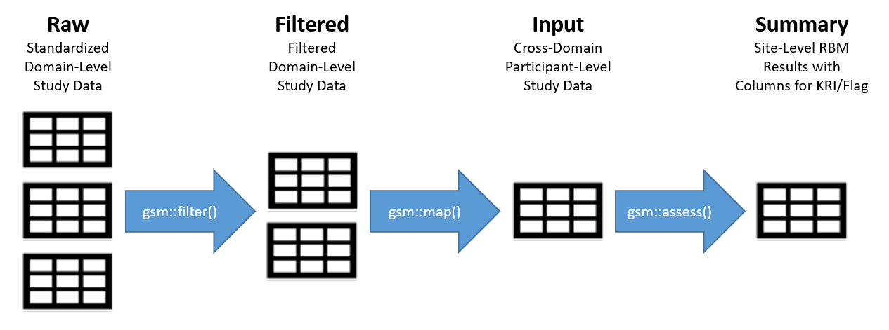

```{r setup, include = FALSE}
library(gsm)
knitr::opts_chunk$set(
  collapse = TRUE,
  comment = "#>"
)
```

# Introduction

The `{gsm}` package provides a standardized workflow that leverages Key Risk Indicators (KRIs) and thresholds to conduct study-level Risk Based Quality Management (RBQM) for clinical trials. This vignette provides an overview of the `{gsm}` data model. First, we provide a summary of the standardized data pipeline used to calculate KRIs and evaluate thresholds to set site-level flags. We also discuss workflows and reports that allow users to run multiple KRIs concurrently on a study.

As an overview, clinical and operational data are analyzed using the `{gsm}` R package, which generate standardized outputs and reports suitable for use in various RBQM activities. The Appendices of this document provide detailed data input and output specifications for `{gsm}`.

# KRI Data Pipeline

{width="125%"}

In the context of clinical research, a KRI is a measure of risk associated with the conduct of a clinical trial. Examples of KRIs include the rate of adverse events or amount of missing data at a site or across sites. Defining and deploying KRIs during study start-up allows sponsors to continually monitor risks to the integrity of the trial and take corrective actions accordingly.

The KRI data pipeline begins with one or more clinical datasets related to the KRI. An optional participant-level subset is then applied to each dataset before aggregating by participant to quantify the KRI at the participant level. This aggregated dataset is then further summarized by site to obtain site-level metrics.

# Assessment Data Pipeline

{width="170%"}

The image above provides an overview of the KRI assessment pipeline. The pipeline is a standardized four-step process for assessing data issues by going from participant-level input data to a standardized site-level summary of model results. The functions used in each step of the data pipeline along with the input and output datasets are described in more detail below.

1.  `dfInput`: Input data: Cross-domain participant-level input data with all needed data for KRI derivation. Created by `Map()` functions as needed.
2.  `dfTransformed`: Transformed data: Site-level transformed data including KRI calculation. Created by `Transform()` functions.
3.  `dfAnalyzed`: Analyzed data: Site-level analysis results data. Created by `Analyze()` functions.
4.  `dfFlagged`: Flagged data: Site-level analysis results with flags added to indicate potential outliers. Created by passing numeric thresholds to a `Flag()` function.
5.  `dfSummary`: Summary data: Standardized subset of the flagged data. This summary data has the same structure for all assessments and always includes both KRI and Flag values so that a user can easily look at trends for any given site across multiple assessments. Created using the `Summarize()` function.

Each assessment has an `Assess()` function that sequentially executes all 4 of the supporting functions and returns a list of datasets. The 4 standard datasets that are always returned are `dfTransformed`, `dfAnalyzed`, `dfFlagged`, and `dfSummary`. An additional dataset, called `dfBounds`, is generated only when the Poisson statistical model is being used. A step-by-step example of the data assessment workflow can be found in the [Data Analysis Vignette](https://github.com/Gilead-BioStats/gsm/wiki/Data-Analysis-Vignette).

### What Statistical Models Are Available For Each Assessment?

-   Adverse Events (AE) and Protocol Deviations (PD): **Poisson or Identity**
-   Subject Consent (Consent) and Inclusion/Exclusion (IE) Criteria: **Identity**
-   Subject Disposition (Disp) and Laboratory (LB) Results: **Fisher or Identity**

{width="170%"}

## Generating Input Data

Generating input data is outside the scope of the assessment pipeline. The specifications for input data (i.e., `dfInput`) are designed to be flexible enough so that this data frame can be generated from multiple clinical data standards (e.g., Raw, Raw+, or CDISC-compliant ADaM). Most assessments have `Map()` functions that can be used to generate input data. For example, the Adverse Event assessment has two `Map()` functions:

-   `AE_Map_Raw()`: creates input data from Raw+ data

-   `AE_Map_Adam()`: creates input data from CDISC-compliant ADaM data

These `Map()` functions are provided for convenience, but may not work for all clinical studies. When no `Map()` function is available for a given assessment, the user is expected to manually create input data following the specifications for that assessment. Details on this can be found in the [Cookbook Vignette](https://github.com/Gilead-BioStats/gsm/wiki/Cookbook-Vignette).

## Running Multiple Assessments

Running multiple assessments simultaneously for a single study is a common use case of `{gsm}` and the package provides workflow and reporting functions to streamline this process.

`Study_Assess()` attempts to run one or more assessment workflows using shared data and metadata. The metadata used for this study-level assessment is described in detail in [Appendix 1](#Appendix-1-Metadata-Technical-Specifications). The `Study_Assess()` function returns a list of assessments containing status information and results that is used as input for the reporting functions described below.

`Study_Report()` creates a detailed report showing both charts and listings summarizing each KRI that was run for the study, along with a study-level table (via `Study_Table()`) and a summary of the workflow run to generate each KRI (via `Study_AssessmentReport()`) .

To see a sample report, simply run:

    results <- Study_Assess()
    Study_Report(results)

Additional examples are provided in the [Cookbook Vignette](https://github.com/Gilead-BioStats/gsm/wiki/Cookbook-Vignette).

# Appendix 1 - Metadata Technical Specifications {#Appendix-1-Metadata-Technical-Specifications}

`{gsm}` has several standardized metadata models that are used to facilitate a standardized, reusable workflow for RBM. The default metadata used by `{gsm}` are stored as YAML files in the `inst` folder, and can be customized for any given study.

Detailed specifications for each type of metadata is provided below, and example data for the Adverse Events (AE) domain is provided.

## Data Specification Metadata

Input data specifications define the data requirements for a given `{gsm}` function and are saved in `inst/specs`.

Each input data specification lists the data domains required for the function and specifies the following parameters for each domain:

-   `vRequired`: list of parameters that should be defined in `mapping` (see more details in the following section)
-   `vUniqueCols`: list of column parameters that should not contain duplicate values
-   `vNACols`: list of column parameters where NA and empty string values are acceptable

The specification for the AE mapping function (`inst/specs/AE_Map_Raw.yaml`) is shown below:

    dfAE:
      vRequired:
        - strIDCol
    dfSUBJ:
      vRequired:
        - strIDCol
        - strSiteCol
        - strTimeOnTreatmentCol
      vUniqueCols:
        - strIDCol
      vNACols:
        - strTimeOnTreatmentCol

## Data Mappings Metadata

Mapping specifications in `{gsm}` define a "mapping" of column and field-level inputs needed for a function. This mapping can be used in combination with a specification to confirm that input data meets the requirements for a function.

Each mapping object lists the required parameters for all required data domains and specifies the column and field values for specific datasets.

For example, the following could be passed to the `mapping` parameter for the `AE_Map_Raw()` function to be used with the default data from `clindata::rawplus_ae` and `clindata::rawplus_dm`:

```{r eval = FALSE, include = TRUE}
list(
  dfAE = list(strIDCol = 'SubjectID'),
  dfSUBJ = list(
    strIDCol = 'SubjectID',
    strSiteCol = 'SiteID',
    strTimeOnTreatmentCol = 'TimeOnTreatment'
  )
)
```

Note that `Study_Assess()` is designed to share a `mapping` object across multiple assessments. The default mapping is saved as a YAML file (`inst/mappings/mapping_rawplus.yaml`). However, users can also create a custom mapping object for their use cases by making a custom YAML file, or by creating or modifying a `list` like that returned by `yaml::read_yaml(system.file("mappings", "mapping_rawplus.yaml", package = "gsm"))`.

## Assessment Workflow Metadata

Assessment workflow metadata objects are passed to the `lAssessments` parameter in `Study_Assess()` to define functions and parameters (including `mappings` and `specs`) across multiple studies.

The `lAssessment` object is a named list of metadata defining how each assessment should be run. By default, `MakeWorkflowList()` imports YAML specifications from `inst/workflow`. Each item in `lAssessments` expects the following parameters:

-   `workflow`: Array defining one or more functions to be executed as part of the workflow for a given assessment
    -   `workflow[]$name`: name of the `{gsm}` function.
    -   `workflow[]$inputs`: specifies the required input data
    -   `workflow[]$output`: specifies the output data from the workflow step, which can be used as an input in the next step in the workflow
    -   `workflow[]$params`: specifies parameters to be passed to the function

For example, the default workflow for the AE assessment (`inst/workflow/kri0001.yaml`) is shown below:

    workflow:
      - name: FilterDomain
        inputs: dfAE
        output: dfAE
        params:
          strDomain: dfAE
          strColParam: strTreatmentEmergentCol
          strValParam: strTreatmentEmergentVal
      - name: FilterDomain
        inputs: dfAE
        output: dfAE
        params:
          strDomain: dfAE
          strColParam: strSeriousCol
          strValParam: strNonSeriousVal
      - name: AE_Map_Raw
        inputs: 
          - dfAE
          - dfSUBJ
        output: dfInput
      - name: AE_Assess
        inputs: dfInput
        output: lResults
        params:
          strGroup: "Site"
          vThreshold: null
          strMethod: "poisson"
          

# Appendix 2 - Data Model Specifications

## `{gsm}` Input Specifications

Input data for `{gsm}` is pulled nightly from several systems. The data sources for `{gsm}` are:

-   **Clinical Data:** Study-level clinical data across multiple data domains saved in the Raw+ format *(detailed specification in future releases)*
-   **Operational Data:** Study-level operational data including operational metadata from Rave and adjudicated Protocol Deviation data from the PD database *(detailed specification in future releases)*
-   **CTMS Data:** Study-level and site-level metadata from Gilda
-   **Metric Data:** Systems Metric and Parameter Definitions (saved directly in `{gsm}`) and Study-Specific Metric Specification data (imported from RACT)
-   **Scheduling Data:** Study-Specific Custom Snapshot Schedule Data

Full details are provided below. Note that Table Name includes all configurable outputs to `Make_Snapshot()`.

### [Tables in `{gsm}` Input Data Model]{.underline}:

```{r echo = FALSE}
gsm_input <- read.csv("gsm_inputs.csv")

library(gt)

gsm_input %>%
  gt() %>%
  cols_label(Table.Source = md("**Table Source**"),
             Table.Name = md("**Table Name**"),
             Structure = md("**Structure**"),
             Description = md("**Description**"),
             Sample.Data.Equivalent = md("**Sample Data Equivalent**")) %>%
  tab_style(style = cell_text(size = "small"),
            locations = cells_body(columns = everything(), rows = everything())) %>%
  tab_style(style = cell_text(size = "small"),
            locations = cells_column_labels(columns = everything()))
```

*\* = Full spec coming in future version*

### [Columns in Nightly `{gsm}` Data Transfer (from above)]{.underline}:

```{r echo = FALSE}
gsm_output <- read.csv("gsm_outputs.csv")

gsm_output %>%
  gt() %>%
  cols_label(Table.Name = md("**Table Name**"),
             Column.Name = md("**Column Name**"),
             Description = md("**Description**")) %>%
  tab_style(style = cell_text(size = "small"),
            locations = cells_body(columns = everything(), rows = everything())) %>%
  tab_style(style = cell_text(size = "small"),
            locations = cells_column_labels(columns = everything()))
```

## Gismo Input Specifications

Input data for Gismo is generated nightly by `{gsm}` using clinical and operational data along with associated metadata. All inputs are transferred nightly as .csv files.

Three types of tables are included in the input data model:

-   **Status Files:** Capture the most recent metadata associated with the RBM analytics for a single study

-   **Result Files:** Capture analytics results including flag status for all workflows run on a single study

-   **Metadata Files:** Capture workflow details for all analytics currently available in `{gsm}` and are shared across all studies

### [Tables in Nightly Gismo Data Transfer]{.underline}:

```{r echo = FALSE}
gismo_input <- read.csv("gismo_inputs.csv")

gismo_input %>%
  gt() %>%
  cols_label(Table.Type = md("**Table Type**"),
             Table.Name = md("**Table Name**"),
             Structure = md("**Structure**"),
             Description = md("**Description**")) %>%
  tab_style(style = cell_text(size = "small"),
            locations = cells_body(columns = everything(), rows = everything())) %>%
  tab_style(style = cell_text(size = "small"),
            locations = cells_column_labels(columns = everything()))
```

### [Columns in Nightly Gismo Data Transfer (from above)]{.underline}:

The following tables are all contained in the output of `gsm::Make_Snapshot()`:

```{r echo = FALSE}
gismo_output <- read.csv("gismo_outputs.csv")

gismo_output %>%
  gt() %>%
  cols_label(Table.Name = md("**Table Name**"),
             Column.Name = md("**Column Name**"),
             Description = md("**Description**")) %>%
  tab_style(style = cell_text(size = "small"),
            locations = cells_body(columns = everything(), rows = everything())) %>%
  tab_style(style = cell_text(size = "small"),
            locations = cells_column_labels(columns = everything()))
```

# Appendix 3 - Workflow ID Basic Specs

Workflow IDs are named using the following practices:

**{type}{workflowid}{\_strata}{\_param}** where:

-   **{type}:** Basic analysis unit of the workflow
    -   kri: site-level
    -   cou: country-level
    -   qtl: study-level
-   **{workflowid}:** 0-padded 4 digit number (e.g., "0001") specifying the workflow used for the assessment
    -   May contain filter, mapping and assessment functions
-   **{\_strata}:** Optional flag indicating a stratified analysis
    -   Format is `_S1`, `_S2`, etc.
-   **{\_param}:** Optional flag indicating a custom parameterization
    -   Format is `_P1`, `_P2`, etc.

Here are a few examples and how they translate:

-   kri0001: site-level assessment for workflow 0001
-   qtl0001: study-level assessment for workflow 0001
-   cou0001: country-level assessment for workflow 0001
-   kri0002_s1: stratified site-level assessment for workflow 0002
-   cou0002_p2: country-level assessment for workflow 0002 run with custom parameters
-   cou0002_p2_s1: stratified country-level assessment for workflow 0002 run with custom parameters
