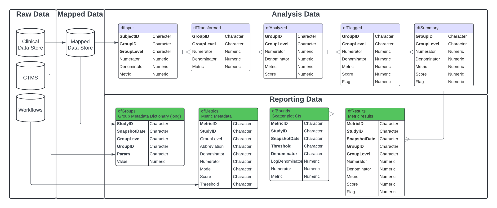
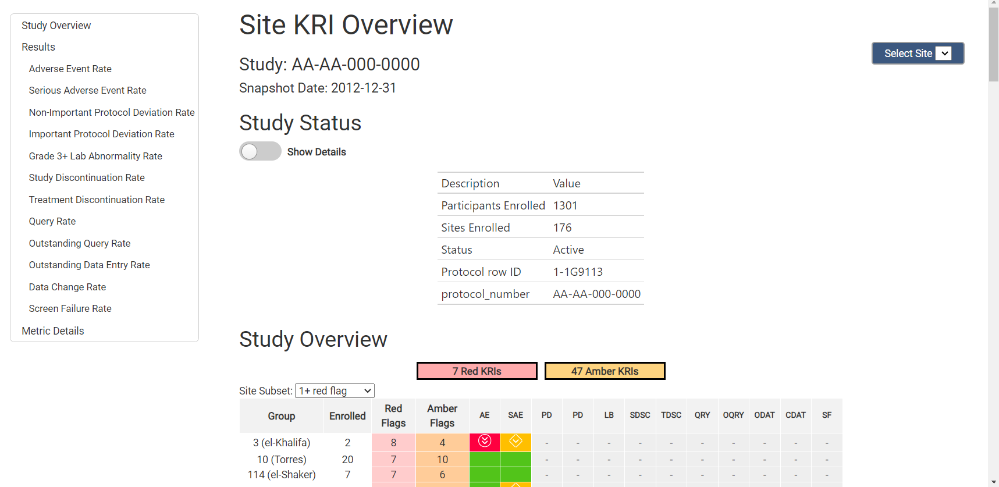

  
```{r setup, include = FALSE}
knitr::opts_chunk$set(
  collapse = TRUE,
  comment = "#>"
)

library(gsm)
library(DT)
library(gt)

dt <- function(data){
  data %>%
    DT::datatable(
      extensions = 'FixedColumns',
      options = list(
        scrollX = FALSE,
        fixedColumns = TRUE
      ),
      rownames = FALSE
    )
}
```

# Introduction

This vignette walks users through the mechanics of the functions and workflows that produce all of the Reporting output within the `{gsm}` package. `{gsm}` leverages Key Risk Indicators (KRIs) and thresholds to conduct study-level, country-level and site-level Risk Based Monitoring for clinical trials.

These functions and workflows produce data frames, visualizations, metadata, and reports to be used in reporting and error checking at clinical sites. The image below illustrates the overarching context in which the reporting workflow runs, taking inputs from both the output of the analytics workflow, as well as raw study-, site-, and country-level data in the Raw/Raw+ format.

{width="100%"}

All of the functions to create the data frames in the reporting data model will run automatically and sequentially when a user specifies the metadata and data needed for the report, and calls upon the `RunWorkflow()` function on the yaml files in the `workflow/3_reporting` directory. To create a report, the output of the reporting yamls is fed into the yamls in the `workflow/4_modules` directoty to produce and html document with all charts and tables created in the reporting workflow. For a more detailed discussion of the yaml file and directory structure, see (`vignette("gsmExtensions")`).

Each of the individual functions can also be run independently outside of a specified yaml workflow.

For the purposes of this documentation, we will evaluate the input(s) and output(s) of each individual function for a specific KRI to show the stepwise progression of how a  yaml workflow is set up to handle and process reporting-level data.

------------------------------------------------------------------------
  
## Case Study - Step-by-Step Full Site-Level Report
  
We will use sample clinical data from the [`{clindata}`](https://github.com/Gilead-BioStats/clindata) package to run the full site-level report for all 12 KRIs included in this package. The focus of this vignette is the reporting workflow, so the output of the analytics workflow will be briefly discussed, but only in the context of *inputs*  to the reporting workflow.

Additional supporting functions are explored in [Appendix 1](#appendix-1).

### Step 0 - Run Analysis Workflow(s)

Prior to running the reporting model to create reporting data frames, charts and reports, the metrics we are reporting on must be properly calculated and flagged with the analysis workflow. For more information on the Analysis Workflow, see the associated `vignette("DataAnalysis")`.

To run the analysis workflow on all 13 KRIs using `clindata` Raw+ data, use the code snippet below. From this, three pieces of output will be used in the reporting workflow:

1. `lAnalysis` -  list of data frames in the analysis data model
2. `lWorkflow` - list containing the metadata for each of the KRIs
3. `mapped$Mapped_ENROLL` - mapped data.frame of enrolled participants

```{r include = TRUE, message = FALSE}
# Create Mapped Data - filter/map raw data
lSource <- UseClindata(
  list(
    "Source_SUBJ" = "clindata::rawplus_dm",
    "Source_AE" = "clindata::rawplus_ae",
    "Source_PD" = "clindata::ctms_protdev",
    "Source_CONSENT" = "clindata::rawplus_consent",
    "Source_IE" = "clindata::rawplus_ie",
    "Source_LB" = "clindata::rawplus_lb",
    "Source_STUDCOMP" = "clindata::rawplus_studcomp",
    "Source_SDRGCOMP" = "clindata::rawplus_sdrgcomp %>%
            dplyr::filter(.data$phase == 'Blinded Study Drug Completion')",
    "Source_DATACHG" = "clindata::edc_data_points",
    "Source_DATAENT" = "clindata::edc_data_pages",
    "Source_QUERY" = "clindata::edc_queries",
    "Source_ENROLL" = "clindata::rawplus_enroll",
    "Source_STUDY" = "clindata::ctms_study",
    "Source_SITE" = "clindata::ctms_site"
  )
)

lRaw <- list(
    Raw_SUBJ = lSource$Source_SUBJ,
    Raw_AE = lSource$Source_AE,
    Raw_PD = lSource$Source_PD %>%
      dplyr::rename(subjid = subjectenrollmentnumber),
    Raw_LB = lSource$Source_LB,
    Raw_STUDCOMP = lSource$Source_STUDCOMP,
    Raw_SDRGCOMP = lSource$Source_SDRGCOMP,
    Raw_DATACHG = lSource$Source_DATACHG %>%
      dplyr::rename(subject_nsv = subjectname),
    Raw_DATAENT = lSource$Source_DATAENT %>%
      dplyr::rename(subject_nsv = subjectname),
    Raw_QUERY = lSource$Source_QUERY %>%
      dplyr::rename(subject_nsv = subjectname),
    Raw_ENROLL = lSource$Source_ENROLL,
    Raw_SITE = lSource$Source_SITE %>%
      dplyr::rename(studyid = protocol) %>%
      dplyr::rename(invid = pi_number) %>%
      dplyr::rename(InvestigatorFirstName = pi_first_name) %>%
      dplyr::rename(InvestigatorLastName = pi_last_name) %>%
      dplyr::rename(City = city) %>%
      dplyr::rename(State = state) %>%
      dplyr::rename(Country = country),
    Raw_STUDY = lSource$Source_STUDY %>%
      dplyr::rename(studyid = protocol_number) %>%
      dplyr::rename(Status = status)
)

# Step 1 - Create Mapped Data Layer - filter, aggregate and join raw data to create mapped data layer
mappings_wf <- MakeWorkflowList(strPath = "workflow/1_mappings")
mapped <- RunWorkflows(mappings_wf, lRaw)

# Step 2 - Create Metrics - calculate metrics using mapped data
metrics_wf <- MakeWorkflowList(strPath = "workflow/2_metrics", strNames = "kri")
lAnalysis <- RunWorkflows(metrics_wf, mapped)
```


### Step 1 - Create Reporting Model Data Frames

With all necessary inputs to the reporting model created, we can move on to generate the reporting data model data frames. These data frames created are as follows:

1. `dfGroups`: Group-level metadata dictionary. Created by passing CTMS site and study data to `MakeLongMeta()`.
2. `dfMetrics`: Metric-specific metadata for use in charts and reporting. Created by passing an `lWorkflow` object to `MakeMetric()`. 
3. `dfResults`: A stacked summary of analysis pipeline output. Created by passing a list of
 results returned by `Summarize()` to `BindResults()`.
4. `dfBounds`: Set of predicted percentages/rates and upper- and lower-bounds across the full range of sample sizes/total exposure values for reporting. Created by passing `dfResults` and `dfMetrics` to `MakeBounds()`. 

For more details on any of these tables, see `vignette("DataModel")`.

The following sub-steps will dive into the creation and structure of each of these tables. Sample data for each of these tables can found in `{gsm}` as `reportingGroups`, `reportingMetrics`, `reportingResults` and `reportingBounds`. These sample tables are used throughout the package in examples and documentation.


#### Step 1.1 - Transform CTMS data into `dfGroups` data frame

The `dfGroups` data frame is critical to providing site-, study- and country-level information in the final report. This table is based on CTMS data and the mapped `dfEnrolled` data frame created in the Analysis workflow. Creating this table requires the creation of 5 smaller tables that summarize the data at each group level using `RunQuery()` and `MakeLongMeta()`. These small tables are then bound together to create `dfGroups`.

```{r include = TRUE, message = FALSE}
#Transform CTMS Site and Study Level data
dfCTMSSite <- RunQuery(df = clindata::ctms_site, 
                       strQuery = "SELECT pi_number as GroupID, site_status as Status, pi_first_name as InvestigatorFirstName, pi_last_name as InvestigatorLastName, city as City, state as State, country as Country, * FROM df") |>
  MakeLongMeta(strGroupLevel = 'Site')

dfCTMSStudy <- RunQuery(df = clindata::ctms_study, 
                        strQuery = "SELECT protocol_number as GroupID, status as Status, * FROM df") |>
  MakeLongMeta(strGroupLevel = 'Study')

# Get Participant and Site counts for Country, Site and Study
dfSiteCounts <- RunQuery(df = mapped$Mapped_ENROLL,
                             strQuery = "SELECT invid as GroupID, COUNT(DISTINCT subjectid) as ParticipantCount, COUNT(DISTINCT invid) as SiteCount FROM df GROUP BY invid") |>
  MakeLongMeta(strGroupLevel = "Site")

dfStudyCounts <- RunQuery(df = mapped$Mapped_ENROLL,
                             strQuery = "SELECT studyid as GroupID, COUNT(DISTINCT subjectid) as ParticipantCount, COUNT(DISTINCT invid) as SiteCount FROM df GROUP BY studyid") |>
  MakeLongMeta(strGroupLevel = "Study")

dfCountryCounts <- RunQuery(df = mapped$Mapped_ENROLL,
                             strQuery = "SELECT country as GroupID, COUNT(DISTINCT subjectid) as ParticipantCount, COUNT(DISTINCT invid) as SiteCount FROM df GROUP BY country") |>
  MakeLongMeta(strGroupLevel = "Country")


# Combine CTMS and Counts data as dfGroups
dfGroups <- dplyr::bind_rows(SiteCounts = dfSiteCounts, 
                      StudyCounts = dfStudyCounts, 
                      CountryCounts = dfCountryCounts, 
                      Site = dfCTMSSite, 
                      Study = dfCTMSStudy)
```

The resulting `dfGroups` dataframe contains the following columns:

-   `GroupID`: Group Identifier
-   `GroupLevel`: Type of Group specified in `GroupID` (Country, Site, Study)
-   `Param`: Parameter Name (e.g. "Status")  
-   `Value`: Parameter Value (e.g. "Active")

A more detailed explanation of the `Param`s for each group level can be found in `vignette("DataModel")`. 

```{r, echo = FALSE, warning = FALSE}
datatable(dfGroups)
```

#### Step 1.2 - Create `dfMetrics` Metadata

The `dfMetrics` table contains the metadata for each of the KRIs in the report. This information comes from the `meta` section of the metric workflows, `metrics_wf` defined in Step 0. Using this workflow information as the input, `MakeMetric()` is used to produce a data frame with one row per metric.


```{r include = TRUE}
dfMetrics <- MakeMetric(lWorkflows = metrics_wf)
```

The resulting `dfMetrics` dataframe contains the following columns:

  - `File`: The yaml file for workflow 
  - `MetricID`: ID for the Metric
  - `Group`: The group type for the metric (e.g. "Site")
  - `Abbreviation`: Abbreviation for the metric
  - `Metric`: Name of the metric
  - `Numerator`: Data source for the Numerator
  - `Denominator`: Data source for the Denominator
  - `Model`: Model used to calculate metric
  - `Score`: Type of Score reported 
  - `Threshold`: Thresholds to be used for bounds and flags 


```{r, echo = FALSE, warning = FALSE}
datatable(dfMetrics)
```

#### Step 1.3 - Stack `dfSummary` data into `dfResults`

The reporting workflow requires that all metrics are stacked into a single data frame, `dfResults`. This stacked data frame is created by feeding the `lAnalysis` list from the analysis workflow into `BindResults()` along with the snapshot date and the study id.

```{r include = TRUE}
dfResults <- BindResults(lAnalysis = lAnalysis,
                         strName = "Analysis_Summary",
                         dSnapshotDate = Sys.Date(),
                         strStudyID = "ABC-123")
```

The resulting `dfResults` data frame contains the following columns:

  - `GroupID`: Group Identifier
  - `GroupLevel`: Type of Group specified in `GroupID` (Country, Site, Study)
  - `Numerator`: The calculated numerator value
  - `Denominator`: The calculated denominator value  
  - `Metric`: The calculated rate/metric value 
  - `Score`: The calculated metric score
  - `Flag`: The calculated flag
  - `MetricID`: The Metric ID
  - `StudyID`: The Study ID
  - `SnapshotDate`: The Date of the snapshot


```{r, echo = FALSE, warning = FALSE}
datatable(dfResults) %>%
formatRound(columns = "Metric", digits = 3)
```

#### Step 1.4 - Create `dfBounds` for Confidence Intervals

Several of the charts created for the KRI reports use confidence intervals and bounds to delineate the observations based on the flag they receive (no flag, amber or red). In order to create the data frame that contains the information about these boundaries, `dfBounds`, `dfResults` and `dfMetrics` is fed into the `MakeBounds()` function. The `MakeBounds()` function is a wrapper around the `Analyze_*_PredictBounds()` functions that create the bounds based on the model used to estimate the metric(Normal Approximation or Poisson).

```{r include = TRUE}
dfBounds <- MakeBounds(dfResults = dfResults,
                        dfMetrics = dfMetrics)
```

The resulting `dfBounds` data frame contains the following columns:

  - `Threshold`: The number of standard deviations that the upper and lower bounds are based on 
  - `Denominator`: The calculated denominator value
  - `LogDenominator`: The calculated log denominator value 
  - `Numerator`: The calculated numerator value 
  - `Metric`: The calculated rate/metric value 
  - `MetricID`: The Metric ID 
  - `StudyID`: The Study ID 
  - `SnapshotDate`: The Date of the snapshot 


```{r, echo = FALSE, warning = FALSE}
datatable(dfBounds) %>%
formatRound(columns = "Metric", digits = 3)
```

### Step 2 - Create Visualizations

Now that all of the data frames in  the reporting data model have been created, we can create the charts that display this data in a useful and easily interpreted way. All four of the data frames created in Step 1 are fed into the `MakeCharts()` function to create all relevant charts given the input data. `MakeCharts()` is a wrapper around several helper functions that generate each static visualization and JS widget individually. Appendix 1 goes into more detail about each of these individual functions.

```{r include = TRUE, warning = FALSE, message = FALSE}
lCharts <- MakeCharts(dfResults = dfResults,
                      dfGroups = dfGroups,
                      dfBounds = dfBounds,
                      dfMetrics = dfMetrics)
```

The output of `MakeCharts` is a list containing the following charts:
 - `scatterJS`: A scatter plot using JavaScript.
 - `scatter`: A scatter plot using ggplot2.
 - `barMetricJS`: A bar chart using JavaScript with metric on the y-axis.
 - `barScoreJS`: A bar chart using JavaScript with score on the y-axis.
 - `barMetric`: A bar chart using ggplot2 with metric on the y-axis.
 - `barScore`: A bar chart using ggplot2 with score on the y-axis.
 - `timeSeriesContinuousScoreJS`: A time series chart using JavaScript with score on the y-axis.
 - `timeSeriesContinuousMetricJS`: A time series chart using JavaScript with metric on the y-axis.
 - `timeSeriesContinuousNumeratorJS`: A time series chart using JavaScript with numerator on the y-axis.
 
If the data only contains one snapshot data then the `timeseries` charts will not be created.
 
Below are the static and interactive versions of the scatter plot for the AE KRI:

```{r fig.height=6, fig.width=8, warning=FALSE}
lCharts$Analysis_kri0001$scatter

lCharts$Analysis_kri0001$scatterJS
```


### Step 3 - Generate Report

All of the components are created to generate the HTML report for the study we are working on. In order to generate this report and save it locally, simply feed `lCharts`, `dfResults`, `dfGroups`, `dfMetrics` and (optionally) an absolute directory path and file to which the report will be saved (`strOutputDir` and `strOutputFile`, respectively) into `Report_KRI()` and the HTML output will be knit from the `Report_KRI.Rmd` template. All intermediate files from the knitting process will be saved in a temporary folder.

```{r eval = FALSE, include = TRUE}
lReport <- Report_KRI(lCharts = lCharts,
                      dfResults = dfResults,
                      dfGroups = dfGroups,
                      dfMetrics = dfMetrics,
                      strOutputFile = "test_kri_report.html")
```

Below, you will see a screenshot from the beginning of the report. All charts for all metrics that were included throughout the analysis and reporting workflows will be included in this report.

{width="100%"}

-------------------------------------------------------------------

## Using YAML Workflows to generate reports

While it is helpful to understand how each step of this process works, we have provided a series of YAML workflow files that make running reports on multiple KRIs easy and with the ability to be automated. 

Here, you will see two options for how to run your workflows. The first is to run the analytics workflow(s), followed by the reporting workflow `data_reporting.yaml` followed by the charts and reports workflow `reports.yaml`. This allows the user to examine the output of each workflow individually before moving on to the next step.

The second option is to run the `snapshot.yaml` workflow, which takes in all raw data (including site and study data) and a few extra metadata arguments at the beginning of the workflow, and the result is a list with all data frames and charts from both models, as well as a report html saved to your working directory.

### Option 1 - Run All Workflows Separately

```{r eval = FALSE, include = TRUE}
# Step 1 - Create Mapped Data - filter/map raw data
# Source Data
lSource <- list(
    Source_SUBJ = clindata::rawplus_dm,
    Source_AE = clindata::rawplus_ae,
    Source_PD = clindata::ctms_protdev,
    Source_LB = clindata::rawplus_lb,
    Source_STUDCOMP = clindata::rawplus_studcomp,
    Source_SDRGCOMP = clindata::rawplus_sdrgcomp %>% dplyr::filter(.data$phase == 'Blinded Study Drug Completion'),
    Source_DATACHG = clindata::edc_data_points,
    Source_DATAENT = clindata::edc_data_pages,
    Source_QUERY = clindata::edc_queries,
    Source_ENROLL = clindata::rawplus_enroll,
    Source_SITE = clindata::ctms_site,
    Source_STUDY = clindata::ctms_study
)

# Step 0 - Data Ingestion - standardize tables/columns names
lRaw <- list(
    Raw_SUBJ = lSource$Source_SUBJ,
    Raw_AE = lSource$Source_AE,
    Raw_PD = lSource$Source_PD %>%
      dplyr::rename(subjid = subjectenrollmentnumber),
    Raw_LB = lSource$Source_LB,
    Raw_STUDCOMP = lSource$Source_STUDCOMP,
    Raw_SDRGCOMP = lSource$Source_SDRGCOMP,
    Raw_DATACHG = lSource$Source_DATACHG %>%
      dplyr::rename(subject_nsv = subjectname),
    Raw_DATAENT = lSource$Source_DATAENT %>%
      dplyr::rename(subject_nsv = subjectname),
    Raw_QUERY = lSource$Source_QUERY %>%
      dplyr::rename(subject_nsv = subjectname),
    Raw_ENROLL = lSource$Source_ENROLL,
    Raw_SITE = lSource$Source_SITE %>%
      dplyr::rename(studyid = protocol) %>%
      dplyr::rename(invid = pi_number) %>%
      dplyr::rename(InvestigatorFirstName = pi_first_name) %>%
      dplyr::rename(InvestigatorLastName = pi_last_name) %>%
      dplyr::rename(City = city) %>%
      dplyr::rename(State = state) %>%
      dplyr::rename(Country = country),
    Raw_STUDY = lSource$Source_STUDY %>%
      dplyr::rename(studyid = protocol_number) %>%
      dplyr::rename(Status = status)
)

# Step 1 - Create Mapped Data Layer - filter, aggregate and join raw data to create mapped data layer
mappings_wf <- MakeWorkflowList(strPath = "workflow/1_mappings")
mapped <- RunWorkflows(mappings_wf, lRaw)

# Step 2 - Create Metrics - calculate metrics using mapped data
metrics_wf <- MakeWorkflowList(strPath = "workflow/2_metrics")
analyzed <- RunWorkflows(metrics_wf, mapped)

# Step 3 - Create Reporting Layer - create reports using metrics data
reporting_wf <- MakeWorkflowList(strPath = "workflow/3_reporting")
reporting <- RunWorkflows(reporting_wf, c(mapped, list(lAnalyzed = analyzed, lWorkflows = metrics_wf)))

# Step 4 - Create KRI Reports - create KRI report using reporting data
module_wf <- MakeWorkflowList(strPath = "workflow/4_modules")
lReports <- RunWorkflows(module_wf, reporting)

#### 3.2 - Automate data ingestion using Ingest() and CombineSpecs()
# Step 0 - Data Ingestion - standardize tables/columns names
mappings_wf <- MakeWorkflowList(strPath = "workflow/1_mappings")
mappings_spec <- CombineSpecs(mappings_wf)
lRaw <- Ingest(lSource, mappings_spec)

# Step 1 - Create Mapped Data Layer - filter, aggregate and join raw data to create mapped data layer
mapped <- RunWorkflows(mappings_wf, lRaw)

# Step 2 - Create Metrics - calculate metrics using mapped data
metrics_wf <- MakeWorkflowList(strPath = "workflow/2_metrics")
analyzed <- RunWorkflows(metrics_wf, mapped)

# Step 3 - Create Reporting Layer - create reports using metrics data
reporting_wf <- MakeWorkflowList(strPath = "workflow/3_reporting")
reporting <- RunWorkflows(reporting_wf, c(mapped, list(lAnalyzed = analyzed, lWorkflows = metrics_wf)))

# Step 4 - Create KRI Report - create KRI report using reporting data
module_wf <- MakeWorkflowList(strPath = "workflow/4_modules")
lReports <- RunWorkflows(module_wf, reporting)
```


----------------------------------------------------------------
    
### Recap - Reporting Workflow 
    
  -   `dfGroups` created from CTMS data using `RunQuery()`, `MakeLongMeta()` and `bind_rows()`
  -   `dfMetrics` created from `lWorkflow` using `MakeMetric()`
  -   `dfResults` created from `lAnalysis$dfSummary` using `BindResults()`
  -   `dfBounds` created from `dfResults` using `MakeBounds()`
  -   List of all charts and tables (`lCharts`) created from `dfResults`, `dfBounds`, `dfMetrics` and `dfGroups` using `MakeCharts()`
  -   Report generated from `lCharts`, `dfResults`, `dfMetrics` and `dfGroups` using `Report_KRI()`
  
-----------------------------------------------------------------
    
# Appendix 1 - Supporting Functions {#appendix-1}
    
  
### Mapping Functions
  
  -   `RunQuery()`: Run a SQL query to create new data.frames with filtering and column name specifications.
  

### Visualization Functions

-   `Visualize_Scatter()`: Creates scatter plot of Total Exposure (in days, on log scale) vs Total Number of Event(s) of Interest (on linear scale). Each data point represents one site. Outliers are plotted in red with the site label attached. This plot is only created when statistical method is **not** defined as `identity`. Chart is called `scatter` in the `lCharts` object.
-   `Visualize_Score()`: Provides a standard visualization for Score or KRI. Charts are called `barScore` or `barMetric` in the `lCharts` object.
-   `Visualize_Metric()`: Creates all available charts and tables for a metric using the data provided.


### Widget Functions

- `Widget_GroupOverview()`: Creates an interactive table displaying the flag distribution for all groups across all metrics.
- `Widget_BarChart()`:  Creates an interactive bar chart visualization for Score or KRI. Charts are called `barScoreJS` or `barMetricJS` in the `lCharts` object.
- `Widget_ScatterPlot()`: Creates an interactive scatter plot of Total Exposure (in days, on log scale) vs Total Number of Event(s) of Interest (on linear scale). Each data point represents one site. Outliers are plotted in red with the site label attached.Chart is called `scatterJS` in the `lCharts` object.
- `Widget_TimeSeries()`: Creates an interactive time series scatter plot of the score, metric or numerator. Charts are called `timeSeriesContinuousScoreJS`, `timeSeriesContinuousMetricJS`, or `timeSeriesContinuousNumeratorJS` in the `lCharts` object.

### Table Functions

- `Report_MetricTable()`: Creates a sortable table displaying the flags per group (e.g. Site, Country) for one metric at a time.

                                                                                                                                                                                       
